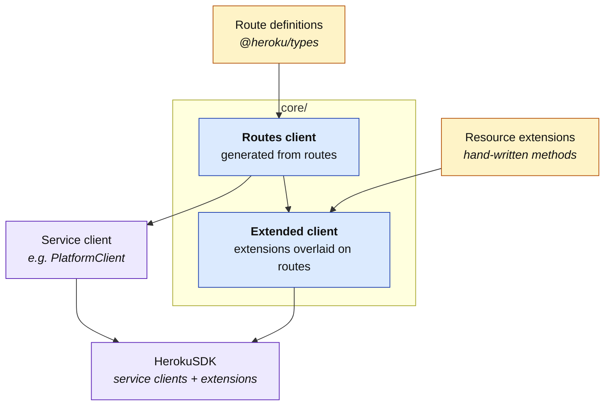

# Core Architecture

The `core/` package turns Heroku route definitions into a fully-typed client at
runtime, and lets you layer hand-written methods on top of it. This document
explains the concepts; for implementation, read the source.

## The big picture

## The two ideas

### 1. A routes registry becomes a client

`@heroku/types` ships a registry of route definitions, shaped roughly like
`{ resource: { method: RouteDefinition } }`. The core wraps that registry in a
Proxy so that any property access — `client.app.info('my-app')` — looks up the
matching route and dispatches an HTTP call.

The payoff: **no method on the SDK is hand-written for upstream routes.** When
`@heroku/types` adds a new route, the corresponding call lights up automatically.

This is what `createPlatformClient` and `createDataClient` return.

### 2. Extensions overlay hand-written methods

Some operations are easier to express as a small composition of route calls — for
example, "enable maintenance mode" is really just a specific `app.update()` call.
Resource modules in `src/resources/` export these as **extensions**: regular
async functions, plus a small bundle that tells the SDK where to install them.

When you build a `HerokuSDK` with extensions, a second Proxy overlays those
methods on top of the routes client. Property access prefers the extension; if
none exists, it falls through to the underlying route. So
`sdk.platform.app.enableMaintenance(...)` (extension) and
`sdk.platform.app.info(...)` (route) live side-by-side on the same namespace.

Extensions receive a context that exposes both raw service clients, so a single
extension can compose calls across `platform` and `data` when needed.

## Why this shape?

- **The routes client stays minimal.** `createPlatformClient` and
  `createDataClient` have no extension overhead — useful when you want the
  smallest possible bundle.
- **The SDK stays ergonomic.** `HerokuSDK` opts into extensions and gets a
  richer, hand-curated surface without losing any of the generated routes.
- **Adding a service is mechanical.** A new service is a thin factory that hands
  its routes registry to the core. No changes to `core/` are needed.
